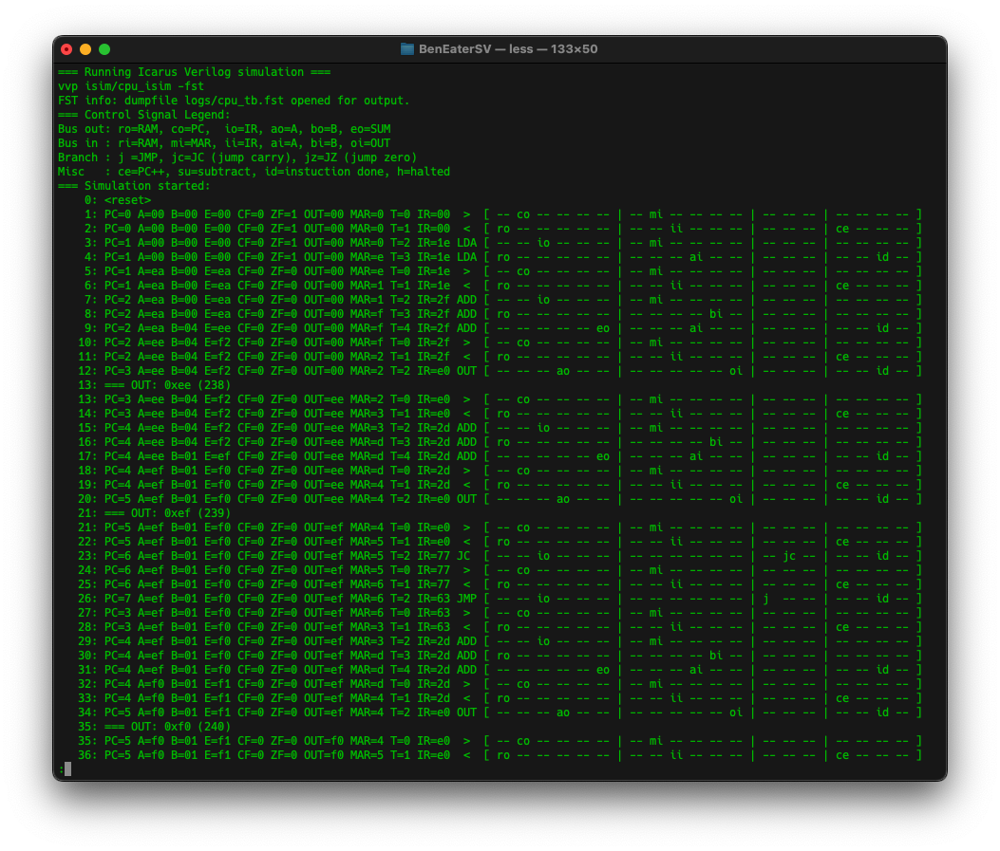
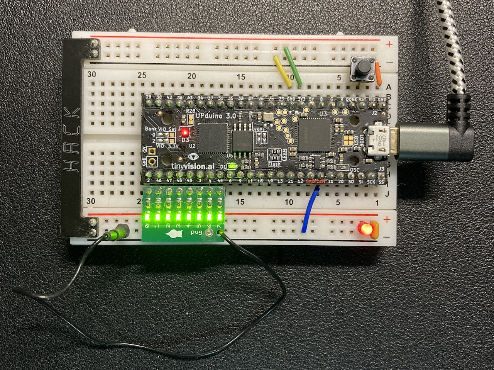
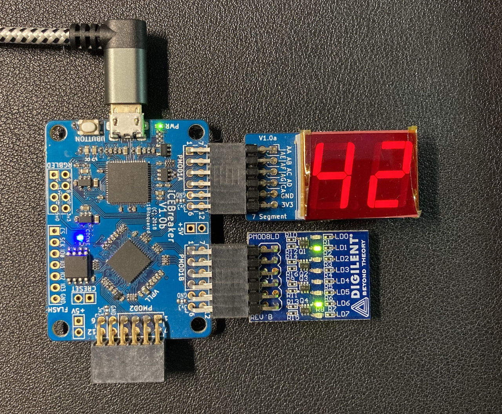

# Ben Eater inspired SAP-1 computer designed in SystemVerilog

[BenEaterSV project](https://github.com/XarkLabs/BenEaterSV)

###### MIT licensed (See top-level LICENSE file for license information.)

This is a  SystemVerilog project to run a simple 8-bit computer very similar to the one built by Ben Eater (see <https://eater.net>).   My thinking was that since
a lot of people understand how Ben's computer works from his excellent videos, it might be useful to use as an example SystemVerilog FPGA project.  I have tried to stay pretty close to Ben's terminology and design, but I couldn't resist changing a few minor things:

* added ID "instruction done" signal to skip any wasted cycles at the end of instruction microcode (instead of all opcodes using the "worst" case number of cycles).
* used FPGA logic instead of ROM for microcode (looks *similar* to the Arduino code Ben used to generate the microcode ROM with)
* clocked FPGA BRAM on negative clock edge to "simulate" async MEM (data available on next CPU cycle)
* no decimal 7-segment decode for output (although this would be a fun thing to add...*[hint]*)
* zero flag is set whenever A register is set equal to zero (not only on zero output from ALU)
* JC and JZ implemtation differs from Ben's, since on an FPGA it was easier to add a bit more logic and control lines vs quadrupling the "microcode ROM" size (which is typically implemented with LUTs anyways, so this is more efficient - and less typing).

It has been developed using the Icarus Verilog and Verilator simulators (so you don't actually need a physical FPGA to try out this design).  It also supports these OSHW boards: [UPduino V3.x](https://github.com/tinyvision-ai-inc/UPduino-v3.0) and [iCEBreaker FPGA](https://github.com/icebreaker-fpga/icebreaker).  Both using the Lattice iCE40UltraPlus5K FPGA and fully open tools from [oss-cad-suite](https://github.com/YosysHQ/oss-cad-suite-build/releases/latest) (so you can build this on Linux, macOS or Windows).

This is a simple educational 8-bit CPU with 8-bit ALU but only a 4-bit address bus (so only 16 memory locations for program and data).  Hence the original name "SAP-1" for "Simple As Possible" (and pretty close to that for a "typical" CPU).  It is controlled by "microcode" that asserts the proper control signals, in the proper sequence to make the CPU function (and define the instruction set).

Here is an example of the output from Icarus Verilog simulator from `make isim`:

Each instruction takes several cycles to execute (aka T-states or T-cycles).  The first two cycles are the same regardless of the opcode and are always used to put the program counter on the memory bus (PC -> MAR), and then to read the next program opcode from memory (IR <- MEM[MAR]) and increment the PC.  Cycles after that are used to perform the work of a specific opcode (so the "fastest" opcode can finished executing in three cycles).

Here are the instructions currently implemented:

    0000 xxxx   NOP             no-operation                    3 cycles
    0001 mmmm   LDA M           A = MEM[M]                      4 cycles
    0010 mmmm   ADD M           A = A+MEM[M] (updates carry)    5 cycles
    0011 mmmm   SUB M           A = A-MEM[M] (updates carry)    5 cycles
    0100 mmmm   STA M           MEM[M] = A                      4 cycles
    0101 nnnn   LDI N           A = N (4-LSB)                   3 cycles
    0110 mmmm   JMP M           PC = M                          3 cycles
    0111 mmmm   JC  M           if (carry) then PC = M          3 cycles
    1000 mmmm   JZ  M           if (zero) then PC = M           3 cycles
    1001 xxxx   ??? (unused, acts like NOP)
    1010 xxxx   ??? (unused, acts like NOP)
    1011 xxxx   ??? (unused, acts like NOP)
    1100 xxxx   ??? (unused, acts like NOP)
    1101 xxxx   ??? (unused, acts like NOP)
    1110 xxxx   OUT             output A register               3 cycles
    1111 xxxx   HLT             halt CPU clock                  3 cycles

For the UPduino FPGA board, the example project has the 8-bits of binary data from OUT opcode put out on 8 GPIO pins (gpio_2 to gpio_44 inclusive).

For the iCEBreaker FPGA board it supports a two digit hex 7-segment output on PMOD1A along with 8-bit binary output on PMOD 1B.

Both boards show a red LED when the program has halted (via HLT) and will flash an LED on each T-cycle (with a slow clock).

The included program is a pointless counting test, but you can enter another program into the 16 memory locations in the `cpu_mem.sv` file.  Several example programs can be found here: [Programs and more Commands for the Ben Eater 8-Bit Breadboard Computer](https://theshamblog.com/programs-and-more-commands-for-the-ben-eater-8-bit-breadboard-computer/) (note that some fancy ones require some new opcodes to be implemented to replace the "unused" opcodes - a nice exercise).

-Xark (<https://hackaday.io/Xark>)
